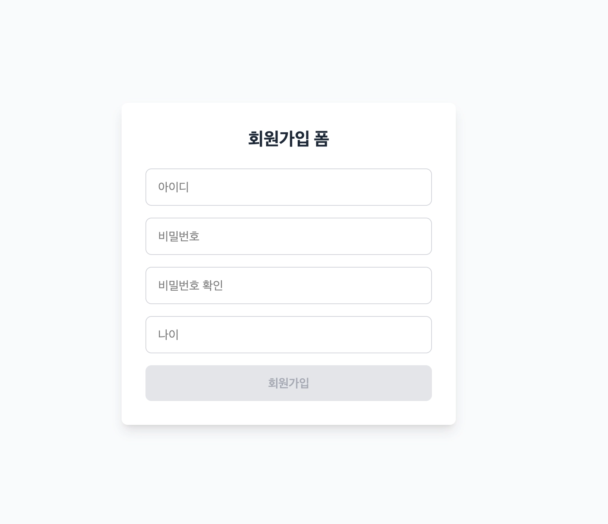

# **과제명**

**회원가입 검증 시스템 완성하기**

# **과제 목적**

이 과제는 JavaScript의 **변수, 상수, 자료형, 연산자, 조건문, 반복문, 함수, 콜백 함수**를 활용하여 회원가입 화면의 핵심 로직을 완성합니다.

핵심 로직을 완성하는데 있어 이번주에 배운 콜백함수를 응용해 어떠한 결과에 따라 다르게 동작하는 함수를 만들 수 있도록 합니다.

실제 웹 애플리케이션에서도 회원가입 가능 여부를 판단하는 검증 함수와, 검증 결과에 따라 성공 또는 실패 처리를 수행하는 후속 함수가 분리되어 동작하는 경우가 많습니다.

또한 코드가 단순히 동작하는 것만으로 충분하지 않다는 점도 함께 학습합니다.

읽기 쉬운 이름과 작은 함수는 코드 이해와 유지보수에 중요하며, 의미 없는 이름과 과도하게 큰 함수는 대표적인 리팩터링 대상이 된다는 점도 유의하면 좋습니다.

# **과제 개요**


다음과 같은 회원가입 화면이 있습니다.

- 사용자는 아이디를 입력한다.
- 사용자는 비밀번호를 입력한다.
- 사용자는 비밀번호 확인 값을 입력한다.
- 사용자는 나이를 입력한다.
- 사용자가 회원가입 버튼을 누르면 프로그램은 입력값을 검사한다.
- 검사 결과에 따라 성공 메시지 또는 실패 메시지를 출력한다.

이때, 입력값을 검사하는 함수와 검사 결과에 따라 다른 동작을 수행하는 함수를 완성 해야 합니다.

# **구현해야 할 함수**

아래 두 함수를 완성합니다.

두 함수는 시그니처만 제공된 상태입니다. 프로그램이 온전히 동작하도록 함수를 완성해주세요.

(두 함수 위치: src/utils/submitSignupForm.js)

## **1. validateSignupForm**

회원가입 입력값이 올바른지 즉, 유효성을 검사하는 함수입니다.

함수의 시그니처는 다음과 같습니다.

```jsx
function validateSignupForm(id, password, passwordCheck, age) {
  // 함수를 완성해 주세요.
}
```

### 매개변수

- **id**: string | 사용자가 입력하는 id입니다.
- **password**: string | 사용자가 입력하는 비밀번호입니다.
- **passwordCheck**:string | 비밀번호를 확인하기 위한 값입니다.
- **age**: number | 사용자가 입력한 나이입니다.

### **본문: 유효성 검사 요구사항**

- 아이디가 4자 이상인지 검사한다.
- 비밀번호가 8자 이상인지 검사한다.
- 비밀번호와 비밀번호 확인 값이 같은지 검사한다.
- 나이가 14 이상인지 검사한다.

### **반환 값**

- 모든 조건 만족 시: **true**
- 조건을 만족하지 못하면 실패 원인을 설명하는 문자열을 반환한다.
  - 아이디: `"아이디는 4자 이상이어야 합니다."`
  - 비밀번호: `"비밀번호는 8자 이상이어야 합니다.”`
  - 비밀번호 체크: `"비밀번호가 일치하지 않습니다.”`
  - 나이: `"14세 이상만 가입할 수 있습니다.”`
- 여러 조건을 만족하지 못한다면 가장 먼저 실패한 에러 1개만 반환한다.
  - ex. 비밀번호 8자리 만족 x , 나이 14세 미만 ⇒ 비밀번호 8자리 만족 x에 대한 에러만 처리.
    - 여러 에러에 대한 처리는 배열을 배운 후 진행합니다.

## **2. submitSignupForm**

회원가입 버튼이 눌렸을 때 실행되는 핵심 함수입니다.

회원가입 폼 제출을 담당합니다.

```jsx
function submitSignupForm(id, password, passwordCheck, age, onSuccess, onFail) {
  // 함수를 완성해 주세요.
}
```

### 매개변수

- **id**: string | 사용자가 입력하는 id입니다.
- **password**: string | 사용자가 입력하는 비밀번호입니다.
- **passwordCheck**:string | 비밀번호를 확인하기 위한 값입니다.
- **age**: number | 사용자가 입력한 나이입니다.
- **onSuccess**: func | 유효성 검사가 유효한 경우에 실행할 콜백 함수입니다.
- **onFail**: func | 유효성 검사가 유효하지 않은 경우에 실행할 콜백 함수입니다.

tip: id, password, passwordCheck, age는 **validateSignupForm**에 전달하기 위해 받는 값들 입니다.

### 본문: 회원가입 폼 제출함수 \*\*\*\*요구사항

- 내부에서 **validateSignupForm()** 함수를 호출한다.
- 위의 함수에서 리턴하는 검사 결과가 **ture**이면 `onSuccess` 콜백 함수를 호출한다.
- 위의 함수에서 리턴하는 검사 결과가 **에러 메세지**라면  `onFail` 콜백 함수를 호출하며 에러 메세지를 전달한다.

### 반환 값

없음(유효성 검사 후 콜백을 실행하는 목적의 함수)

# **(권장) 유효성 검사 함수 분리**

아래와 같이 유효성 검사 함수를 여러 개로 나누는 방식도 권장합니다.

- `validateId(id)`
- `validatePassword(password, passwordCheck)`

이처럼 하나의 큰 함수를 작은 함수로 나누면 각 함수가 하나의 책임에 집중하게 되고, 읽기와 수정이 쉬워집니다.

함수 이름은 수행하는 동작과 목적을 드러내야 하며, `do`, `run`, `process`처럼 모호한 이름은 피하는 것이 좋습니다.

## **필수 구현 조건**

다음 조건을 반드시 지켜서 작성한다.

- 배열, 객체 사용을 지양합니다. (사용하게 된다면 확실한 이유를 설명할 수 있으면 좋습니다.)
- 함수 선언문 또는 함수 표현식으로 작성한다.
- 여러 조건문을 활용하여 조건을 판단한다.
- 비교 연산자와 논리 연산자를 사용한다.
- 문자열, 숫자, 불리언 자료형의 의미를 구분하여 사용한다.
- 성공 처리 함수와 실패 처리 함수는 각각 별도의 콜백 함수로 작성한다.
- 최종 결과는 콘솔과 화면 내 회원가입 결과 영역으로 확인한다.

그 외 내용은 노션 자료를 확인해주세요.
